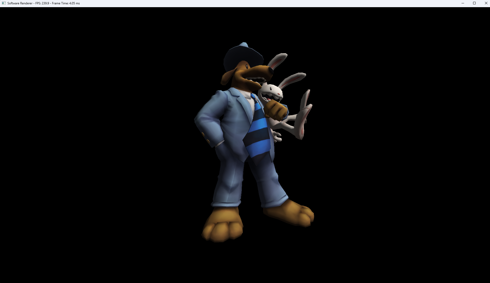

# SSE Software Rasterizer

A multi-threaded tile‑based software renderer using SSE intrinsics on Windows.

---
## 📋 Prerequisites
- Windows
- Python (for `init.py`)
- Conan (C++ package manager)
- Visual Studio
---
## 🛠 Getting Started
```powershell
git clone https://github.com/Cameron2001/SSE_Software_Rasterizer
cd SSE-Software-Rasterizer
python init.py
```

Open the `.sln` in Visual Studio, choose Debug or Release, and run.

---

## 🚀 Features

- 16×16 tile binning for workload division  
- Multithreaded, lock-free tile dispatch using `std::execution::par`  
- Backface culling
- 4 pixel wide SIMD processing
- Perspective-correct interpolation of depth, UVs, and normals  
- Simple ambient + Lambertian diffuse shading  

---

## 🏗 Algorithm

**1. Tile grid**  
&nbsp;&nbsp;Divide the screen into 16×16 pixel tiles.

**2. Triangle binning**  
&nbsp;&nbsp;Assign each triangle to all overlapping tiles by its screen‑space bounding box.

**3. Parallel dispatch**  
&nbsp;&nbsp;Rasterize tiles concurrently with `std::execution::par`.

**4. Scanline pass**  
&nbsp;&nbsp;Within each tile, walk horizontal scanlines to cover candidate pixels.

**5. Edge tests**  
&nbsp;&nbsp;Evaluate half‑space equations (A·x + B·y + C ≥ 0) on 4 pixels at once using SSE.

**6. Barycentric weights**  
&nbsp;&nbsp;Derive depth, UV and normal interpolation factors from edge values.

**7. Depth Testing**  
&nbsp;&nbsp;Perform depth testing to skip occluded pixels.

**8. Perspective‑correct**  
&nbsp;&nbsp;Interpolate attributes × 1/W, then divide by the interpolated 1/W.

**9. Fragment Shading**  
&nbsp;&nbsp;Sample textures and apply ambient + Lambertian diffuse lighting.

---

## 📷 Screenshot



---

## 📦 Third‑Party Libraries

- GLM (math)  
- TinyObjLoader (OBJ parsing)  
- stb_image (textures)  
- Conan (package manager)  

---

## 🔗 Resources

- Sam & Max model (Sketchfab):  
  https://sketchfab.com/3d-models/sam-max-7bcb897df5b743909ede7ad9983a5178  
- Intel Intrinsics Guide:  
  https://www.intel.com/content/www/us/en/docs/intrinsics-guide/index.html  
- Rasterization Blog:  
  https://jtsorlinis.github.io/rendering-tutorial
- Rasterization Video:  
  https://www.youtube.com/watch?v=k5wtuKWmV48
- Conan + Premake Template:  
  https://github.com/Ohjurot/ConanPremakeTutorial2  

---

## ⚖️ License

MIT. See [LICENSE](LICENSE).
